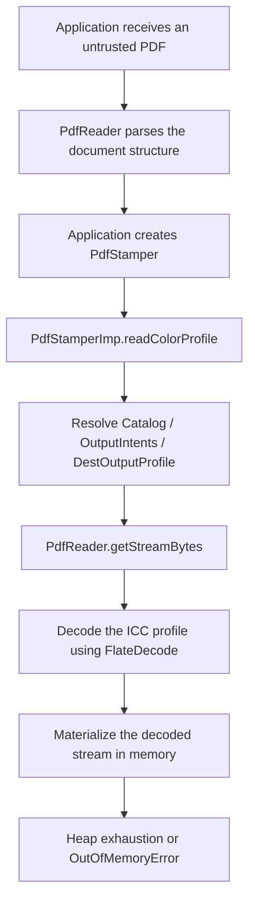

+++
date = '2026-07-10'
draft = false
title = 'PDF Deflate bombs'
tags = ["pdf", "dos", "deflate", "itext", "parsers"]
images = ["/images/posts/pdf-deflate-bombs.png"]

[cover]
image = "/images/posts/pdf-deflate-bombs.png"
alt = "PDF Deflate bombs"
relative = false
+++

# Table of contents

* [PDF Deflate bombs](#pdf-deflate-bombs)
* [PDF streams in one minute](#pdf-streams-in-one-minute)
* [Where the bomb lives](#where-the-bomb-lives)
* [Lazy parsing](#lazy-parsing)
* [The more realistic iText trigger: PdfStamper](#the-more-realistic-itext-trigger-pdfstamper)
* [Why the protection did not help](#why-the-protection-did-not-help)
* [Why this matters in real services](#why-this-matters-in-real-services)
* [Practical mitigations](#practical-mitigations)
* [Takeaway](#takeaway)


# PDF Deflate bombs

While reviewing PDF processing flows in internal services, I started digging into known attack surfaces around PDF parsers and the internals of the format itself.

PDFs turned out to be a surprisingly rich target: the format is built around indirect objects, streams, filters, decoding logic, fonts, images, metadata and many other structures that can become interesting from an attack perspective.

One DoS primitive that stood out during this research was the classic compression bomb, applied to PDF streams through `/Filter /FlateDecode`.

Compression bombs and parser-level DoS issues are well-known. A popular example is image decompression bombs, sometimes also called pixel flooding.

What interested me was how easy it was to reproduce the primitive in a valid PDF file, how different PDF APIs trigger stream decoding at different points, and how this can still become dangerous in real services that process untrusted PDFs.

This post is a short breakdown of how this primitive works inside PDF streams, what parts of the PDF format make it possible, and where it becomes dangerous in real services that process untrusted PDFs.


## PDF streams in one minute

To understand why decompression bombs works, it helps to look at one basic PDF building block: streams.

I used **John Whitington's PDF Explained** as a refresher for the format internals.

A PDF file is not just a flat document. It is closer to a graph of many objects. The trailer points to the catalog, the catalog points to the page tree, pages reference content streams, and other objects may reference images, fonts, metadata, ICC profiles, embedded files, and so on.

A stream is an indirect PDF object with a dictionary and raw bytes:

```pdf
4 0 obj  - The page contents stream
<<
  /Length 65
>>
stream
1. 0. 0. 1. 50. 700. cm  - Position at (50, 700)
BT - Begin text block
  /F0 36. Tf  - Select /F0 font at 36pt
  (Hello, World!) Tj  - Tj Place the text string
ET  End text block
endstream  - End of stream
endobj
```

The important detail is that `/Length` describes the number of bytes stored in the file. If the stream is compressed, `/Length` describes the compressed size, not the final decoded size.

PDF streams can also have filters. A filter is a decoder that tells the PDF reader how to transform the stored stream bytes before using them. In practice, filters are used for compression, encoding, etc.

For example:

```pdf
<< /Length 275 /Filter /FlateDecode >>
stream
...compressed bytes...
endstream
```

`/FlateDecode` means that the stream bytes are compressed with the zlib/deflate algorithm. This is normal PDF behavior and is widely used in real documents.

PDF also supports filter arrays, so a stream can be transformed through more than one decoder:

```pdf
/Filter [/ASCII85Decode /DCTDecode]
```

This is very useful for real documents. The PDF object structure can be parsed without decompressing every objects streams. A reader can decode heavy streams only when needed.

The security problem appears when an application or library takes an attacker-controlled compressed stream and fully materializes the decoded result in memory.

## Where the bomb lives

Deflate is very effective at compressing repetitive data. For example, a huge buffer of zero bytes can become very small on disk. 

The bug class appears when a parser or a consuming API does this:

```java
byte[] decoded = decodeFlate(streamBytes);
```

If there is no strict decoded-size limit, a small PDF stream can expand into hundreds of megabytes or even gigabytes of data.

A minimal page-content version looks like this:

```pdf
3 0 obj
<< /Type /Page
   /Parent 2 0 R
   /MediaBox [0 0 1 1]
   /Contents 4 0 R >>
endobj

4 0 obj
<< /Length 1944360 /Filter /FlateDecode >>
stream
...1.9 MB of deflated bytes...
endstream
endobj
```

Nothing in this dictionary says that the stream expands to almost 2 GB or even more. The parser only sees that it has to read about 1.9 MB of compressed bytes from the file and then apply `/FlateDecode`.

In my local test, the PDF was about 1.9 MB on disk. After decoding, JVM heap usage jumped to about 5.7 GB after a single API call that materialized the decoded page content.

The example of Java generator for such pdf bombs:

```java
private static byte[] deflateZeros(int inflatedBytes) throws Exception {
    ByteArrayOutputStream compressed = new ByteArrayOutputStream();
    Deflater deflater = new Deflater(Deflater.BEST_COMPRESSION);
    DeflaterOutputStream zip = new DeflaterOutputStream(compressed, deflater);

    byte[] chunk = new byte[8192];
    int remaining = inflatedBytes;
    while (remaining > 0) {
        int size = Math.min(chunk.length, remaining);
        zip.write(chunk, 0, size);
        remaining -= size;
    }

    zip.close();
    return compressed.toByteArray();
}
```

The payload is just a valid compressed stream.

## Lazy parsing

One of the first interesting observations was that simply opening the PDF did not trigger the attack.

For example:

```java
PdfReader reader = new PdfReader(pdfBytes);
int pages = reader.getNumberOfPages();
```

This completed normally and thats why PDF is efficient for normal use. The reason is that iText doesn't need to decode the page `/Contents` stream just to parse the document or count its pages. It can walk the PDF object structure and page tree while leaving the compressed stream untouched.

The decompression is triggered only when an API actually requests the decoded content:

```java
PdfReader reader = new PdfReader(pdfBytes);
byte[] content = reader.getPageContent(1);
```

At that point, the library needs the decoded page content bytes. If the stream is a deflate bomb and the implementation materializes the decoded result as a full `byte[]`, the request can turn into a large heap allocation.

In my lab run against iText:

```text
pdf bytes = 1944360
declared inflated payload = 1999999999 bytes ~= 1907 MiB
reader parsed, pages = 1
decoded page content length = 1999999999
elapsed ms = 1466
used memory before = 21281864
used memory after = 5768752744
```

So the important question is not whether a library can parse the PDF. It is which streams a particular workflow eventually decodes and materializes in memory.

## The more realistic iText trigger: PdfStamper

The page-content vector is easy to understand, but it requires a code path that reads page content.

The more interesting case I found was through document output intents. A PDF catalog can include `/OutputIntents`, and an output intent can point to an ICC profile stream through `/DestOutputProfile`.

Simplified structure:

```pdf
1 0 obj
<< /Type /Catalog
   /Pages 2 0 R
   /OutputIntents [
     << /Type /OutputIntent
        /S /GTS_PDFA1
        /OutputConditionIdentifier (poc)
        /Info (poc)
        /DestOutputProfile 5 0 R >>
   ] >>
endobj

5 0 obj
<< /N 3 /Length 1944360 /Filter /FlateDecode >>
stream
...deflated ICC profile payload...
endstream
endobj
```

`/OutputIntents` are used to describe the intended output color condition of the document. `/DestOutputProfile` points to an ICC profile stream. `/N 3` means the profile has three color components, for example RGB.

In iText this path is reachable during stamping:

```java
PdfReader reader = new PdfReader(properties, inputStream);
PdfStamper stamper = new PdfStamper(reader, outputStream);
```

The important part is that `PdfStamper` construction reads the color profile. In the source code of iText, `PdfStamperImp` calls `PdfStamperImp.readColorProfile()` that gets `/OutputIntents`, finds `/DestOutputProfile`, and calls `PdfReader.getStreamBytes(...)` before `ICC_Profile.getInstance(...)` validates the profile.

That means the expensive operation happens before the application receive a normal validation error for an invalid profile.

The simplified attack chain looked like this:



## Why the protection did not help

iText has memory-limit-aware classes around decompression. At first glance that sounds like the exact defense we want.

The detail is in when the guard is activated.

In the iText code I looked at, `PdfReader.decodeBytes(...)` builds the filter list and enables `beginDecompressedPdfStreamProcessing()` only when it sees a repeated filter name in the filter chain. If the stream has a normal single filter:

```pdf
/Filter /FlateDecode
```

the code path does not mark the current stream as one that should be considered by the memory-limit-aware output stream.

But with a repeated filter chain like:

```pdf
/Filter [/FlateDecode /FlateDecode]
```

the protection is activated and the configured limit can produce a `MemoryLimitsAwareException`.

This is why the same general decompression primitive can behave differently depending on filter shape. Protection in Itext recognizes narrower "suspicious" patterns can miss a plain single-filter stream that still expands to an attacker-controlled size.

## Why this matters in real services

The primary impact of this issue is availability.

But availability issues can still be serious when PDF processing happens inside the main application process:
- a small upload can cause a large heap allocation
- even if the request fails, the JVM may suffer from GC pressure
- in containers, the process may be killed by the memory limit
- retries can amplify the problem
- one malicious file can affect unrelated requests if processing is done in the same service.

The highest-risk applications are those that accept untrusted PDFs and perform additional processing instead of simply storing the uploaded file. For example, this applies to services that perform stamping, signing, information extraction from PDFs, preview rendering, conversion to other formats, and similar processing.

The important question is not whether the library can open the PDF. The real question is which streams a particular workflow decodes, and whether the size of the decoded data is properly bounded.

## Practical mitigations

Upload size limits are necessary, but they do not stop compression bombs. A 2 MB PDF can still ask the server to allocate hundreds of MB or more after decompression.

The most effective mitigations are:
- Run PDF processing in a separate worker process or container with a strict memory limit
- Limit concurrency so that a single malicious file cannot consume all processing workers
- Enforce wall-clock timeouts and terminate the worker if processing exceeds the limit
- Configure library-level memory limits where available
- Avoid materializing decoded streams as `byte[]` unless the decoded size is bounded
- Test all code paths that may trigger stream decoding

If you use iText, consider upgrading to version [Itext Core 9.7.0](https://github.com/itext/itext-java/releases/tag/9.7.0), which introduces additional protection for this class of issues.

## Takeaway

PDF is built around a graph of objects. That is one of the reasons it works well as a document format: readers can jump through the file, inspect dictionaries, and decode heavy streams only when required.

The dangerous part is not the compressed PDF itself. It is the moment when an application decides to fully decode an attacker-controlled stream without enforcing limits.

References I used while writing this:

- **John Whitington, PDF Explained**, especially the sections on file structure, streams, filters, and compression
- RFC 1950, the zlib compressed data format used by PDF `/FlateDecode`
- Local iText experiments
